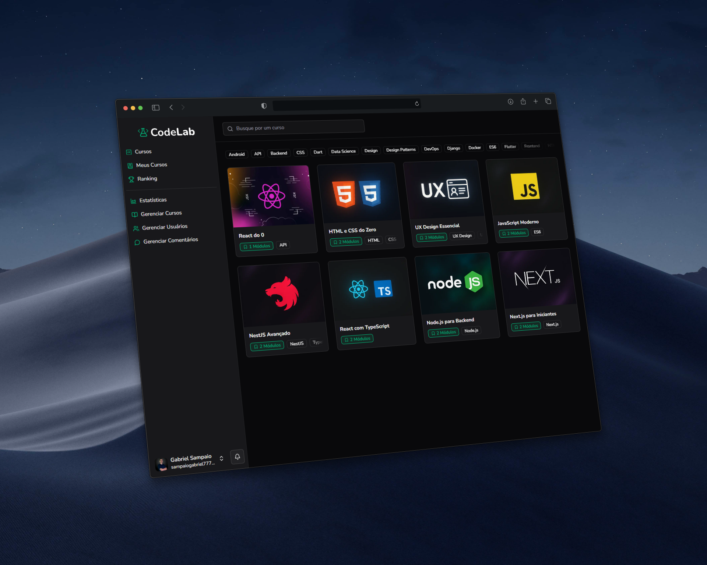

# CodeLab

A fullstack platform for educational content management and delivery, featuring authentication, payments, and AI integration.



## 📚 About the Project

**CodeLab** is an educational platform that allows you to:

- Manage courses and lessons with a JSON-based structure.
- Integrate AI features to enhance user experience.
- Handle payments and subscriptions using the Asaas API.
- Manage users and authentication with Clerk.
- Store files using Cloudflare R2.

## 🚀 Technologies Used

- **Next.js**: React framework for web applications.
- **Prisma**: ORM for database management.
- **TypeScript**: JavaScript superset with static typing.
- **Tailwind CSS**: Utility-first CSS framework.
- **Clerk**: Authentication and user management service.
- **Asaas**: API for payments and subscriptions.
- **Cloudflare R2**: Object storage service.

## 🔧 Environment Variables

To set up the project, create a `.env` file at the root with the following variables:

### Clerk

```env
NEXT_PUBLIC_CLERK_PUBLISHABLE_KEY=""
CLERK_SECRET_KEY=""
CLERK_WEBHOOK_SECRET=""
```

### Asaas

```env
ASAAS_API_KEY=""
ASAAS_API_URL=""
ASAAS_WEBHOOK_TOKEN=""
```

### Neon (Prisma)

```env
DATABASE_URL=""
```

### Cloudflare R2

```env
CLOUDFLARE_ACCOUNT_ID=""
CLOUDFLARE_ACCESS_ID=""
CLOUDFLARE_ACCESS_KEY=""
CLOUDFLARE_R2_BUCKET_NAME=""
CLOUDFLARE_FILE_BASE_PATH=""
```

## ⚙️ Useful Commands

- Start development server:

```bash
npm run dev
```

- Run Prisma migrations:

```bash
npx prisma migrate dev
```

- Open Prisma Studio:

```bash
npx prisma studio
```

## 📄 License

This project is licensed under the [MIT License](LICENSE).

## 📬 Contact

For more information, reach out to [Gabriel Sampaio](https://github.com/sampaiogabriel).
